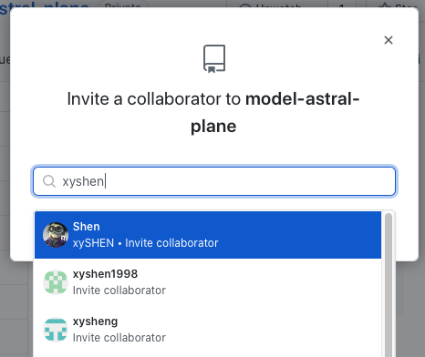

# KT Coding Club: Collaboration and Code Review


Collaboration is the essence and reason for using version control. In practice, collaboration in Git takes three main forms:

1. Collaborating with your past and future selves
2. Collaborating with yourself using different computers (e.g., laptop and cluster)
3. Collaborating with a colleague. 

Today we will focus on #3, but the skills you'll learn are also applicable to #1 and #2. We'll use a "buddy system" where you will collaborate with a coding partner, see what happens when you both try to commit changes to a file at the same time ("merge conflict"), and learn some effective ways to managing your work with a collaborator using git tools ("branches") and GitHub features ("pull requests").

We'll call our buddies "Buddy A" and "Buddy B".

## 1: Setting up a new repository

1. **Buddy A**: Create a new repository.
	
	
2. **Buddy A**: initialise the repository with a README or add it yourself. Clone the repository to your computer.
3. **Buddy A**: grant read/write access on the repository to **Buddy B**. 
 	- Go to *Settings* > *Manage Access* (you'll be prompted for your password)
    
    - Under *Manage Access* click the "Invite a collaborator" button
      
    - Enter Buddy B's **username** *(note that the field will suggest the names of all GitHub users)*
  	  
4. **Buddy B**: Accept the invitation
	- Go to the page for the repository and clone the repository to your computer.
  
## Sharing changes

5. **Buddy A** Update the project title in the `README.md`.
	```
	# Our Collaborative Project
	``` 
6. **Buddy A** `add`, `commit`, and `push` your changes to GitHub
7. **Buddy B** `pull` Buddy's changes.
8. **Buddy B** Make a change to `README.md` and `push` it to Buddy A.

## Managing merge conflicts

9. **Buddy A** Change the title of the project
	```
	# Our Amazing Collorative Project
	```
10. **Buddy B** Change the title of the project
	```
	# Our Stupendous Collorative Project
	```
11. **Buddy A** `add`, `commit`, and `push` your changes.
12. **Buddy B** `pull` from the repository. **Question: what message do you get?**
	```
	✓model-astral-plane % git pull                    (main) model-astral-plane-b
	remote: Enumerating objects: 5, done.
	remote: Counting objects: 100% (5/5), done.
	remote: Total 3 (delta 0), reused 3 (delta 0), pack-reused 0
	Unpacking objects: 100% (3/3), 290 bytes | 96.00 KiB/s, done.
	From github.com:mja/model-astral-plane
	   09b05d4..671575c  main       -> origin/main
	Updating 09b05d4..671575c
	error: Your local changes to the following files would be overwritten by merge:
		README.md
	Please commit your changes or stash them before you merge.
	Aborting
	```
12. **Buddy B** `add` and `commit` your changes and then `pull` again. **What message do you get now?**
	```
	Auto-merging README.md
	CONFLICT (content): Merge conflict in README.md
	Automatic merge failed; fix conflicts and then commit the result.
	```
13. **Buddy B**: Examine the `README.md` file:
	```
	<<<<<<< HEAD
	# Our Stupendous Collaborative Project
	=======
	# Our Amazing Collaborative Project
	>>>>>>> 671575c4068892ac2fb5e291737977c88c35b337
	```
	The first section starting with `<<<<<<< HEAD` shows the content in Buddy B's most recent commit ("`HEAD`"). The conflicting commit contents starts on the `=======` line and finishes with `>>>>>>>` followed by the commit hash.
14. **Buddy B**: Edit the `README.md` merge conflict section to reconcile the two sets of changes:
	```
	# Our Amazingly Stupendous Collorative Project
	```
	`add`, `commit`, and `push` the changes to Buddy A.


## Branching

## Pull requests


